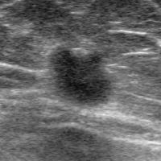
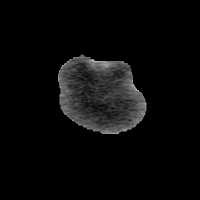

## Automatic Trimap Generator ##

<b>Introduction: </b> 
<ul>
<li/>In image matting, trimap has become an integral part of separating foreground from its background. Trimap attempts to separate foreground and background using unknown region to estimate specific regions in the image
<li/> Mathematically, an image can be represented by the following equation:
</ul>
<p align="center">
<a href="https://www.codecogs.com/eqnedit.php?latex=I_p&space;=&space;\alpha_p&space;F_p&space;&plus;&space;(1-\alpha_p)B_p;\,&space;\alpha_p&space;\in&space;[0,1]" target="_blank"></a>
</p>
<br />
In this equation, <i>I<sub>p</sub></i> denotes the entire image, <i>F<sub>p</sub></i> denotes a defnite foreground, and <i>B<sub>p</sub></i> denotes a definite background. <br/> 
On the other hand, <a href="https://www.codecogs.com/eqnedit.php?latex=\alpha_p" target="_blank"></a> is an alpha matte constants with a range value between 0 and 1. An <a href="https://www.codecogs.com/eqnedit.php?latex=\alpha_p" target="_blank"></a> value of 0 indicates that the pixel belongs to a foreground; whereas an <a href="https://www.codecogs.com/eqnedit.php?latex=\alpha_p" target="_blank"></a> value of 1 indicates otherwise. Any <a href="https://www.codecogs.com/eqnedit.php?latex=\alpha_p" target="_blank"></a> value in between means a mixed pixel. <br />

<b>Description: </b> 
<ul>
<li/>Generate a grayscale trimap (foreground, background, and unknown regions) from an input of binary (mask) image.
<li/>Foreground has a pixel value of 255; background has a pixel value of 0; and unknown has a pixel value of 127.
<li/>In this example, the trimap is generated by extending a binary image of a previously segmented tumor. 
<li/>The binary image consists of two parts: foreground (white) which is the tumor and background (black) which is the surrounding region
<li/>Keep in mind that the unknown region is simply an approximation rather than an exact delineation. Therefore, matting process becomes a crucial key to extract foreground images with exact precision (<b>Deep Image Matting</b> anyone?)
</ul>
<br /><b>Input :</b> a binary image (from a segmented lesion)
<br /><b>Output:</b> a trimap with unknown region (gray) from tumor dilation
<hr />
<b>May 25, 2018: </b> <br/>

- [x] Update(s): create a function that converts a binary image to a trimap
- [x] To Do: documentation to accompany the code, a program that directly & recursively converts binary images to trimaps 
---
<b>December 30, 2018: </b> <br/>

- [x] Update(s): documentation with illustrations
- [x] Online interactive tutorial using Jupyter Notebook
- [x] Separate module: **trimap_module.py**

---
<b> TO DO: </b> <br/>
- [ ] Recursive function of the module that can handle multiple input images
- [ ] Enable image erosion option prior to trimap generation

---
## Example ##

**PROCESS:** Dilating the binary image <br/>
```python
name    = "./image/samples/seg_image.png";
size    = 10; # how many pixel extension do you want to dilate
number  = 1;  # numbering purpose (in case more than one image are available)
bin_img = cv2.imread(name, cv2.IMREAD_GRAYSCALE)
trimap_generate(bin_img, name, size, number)
```
|**FULL IMAGE**| **MASK IMAGE**|**FOREGROUND**| **BACKGROUND**|
|:----------:|:----------:|:----------:|:----------:|
||  |   |  

|**BINARY IMAGE**|**TRIMAP (10 PX)**|**TRIMAP (20 PX)**|**TRIMAP (30 PX)**|
|:----------:|:----------:|:----------:|:----------:|
||||| 

## References ##
1. Vikas Gupta and Shanmuganathan Raman. (2017). "Automatic Trimap Generation for Image Matting". Indian Institute of Technology, Gandhinagar, IND [download](https://arxiv.org/pdf/1707.00333.pdf)
2. Olivier Juan and Reanud Keriven. (2005). "Trimap Segmentation for Fast and User-Friendly Alpha Matting". FRA [download](http://imagine.enpc.fr/publications/papers/05vlsm_c.pdf)
