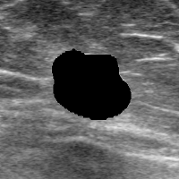
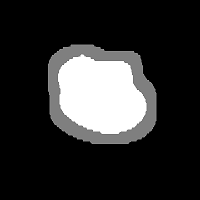

## Automatic Trimap Generator ##

<b>Description: </b> 
<ul>
<li/>Generate a grayscale trimap (foreground, background, and unknown regions) from an input of binary (mask) image.
<li/>Foreground has a pixel value of 255; background has a pixel value of 0; and unknown has a pixel value of 127.
<li/>In this example, the trimap is generated by extending a binary image of a previously segmented tumor. 
<li/>The binary image consists of two parts: foreground (white) which is the tumor and background (black) which is the surrounding region
<li/>Keep in mind that the unknown region is simply an approximation rather than an exact delineation. Therefore, matting process becomes a crucial key to extract foreground images with exact precision (<b>Deep Image Matting</b> anyone?)
</ul>
<br /><b>Input :</b> a binary image (from a segmented lesion)
<br /><b>Output:</b> a trimap with unknown region (gray) from tumor dilation
<hr />
<b>May 25, 2018: </b> <br/>

- [x] Update(s): create a function that converts a binary image to a trimap
- [x] To Do: documentation to accompany the code, a program that directly & recursively converts binary images to trimaps 
---
<b>December 30, 2018: </b> <br/>

- [x] Update(s): documentation, illustration, and tutorial
---
<b> TO DO: </b> <br/>
- [x] Recursive function of the module that can handle multiple input images
- [x] Online interactive module version using Jupyter Notebook

---
## Example ##

**PROCESS:** Dilating the binary image <br/>
```python
name    = "./image/samples/seg_image.png";
size    = 10; # how many pixel extension do you want to dilate
number  = 1;  # numbering purpose (in case youu have more than one image)
bin_img = cv2.imread(name, cv2.IMREAD_GRAYSCALE)
trimap_generate(bin_img, name, size, number)
```
|**FULL IMAGE**| **MASK IMAGE**|**FOREGROUND**| **BACKGROUND**|
|:----------:|:----------:|:----------:|:----------:|
||  |   |  

|**BINARY IMAGE**|**TRIMAP (10 PX)**|**TRIMAP (20 PX)**|**TRIMAP (30 PX)**|
|:----------:|:----------:|:----------:|:----------:|
||||| 
